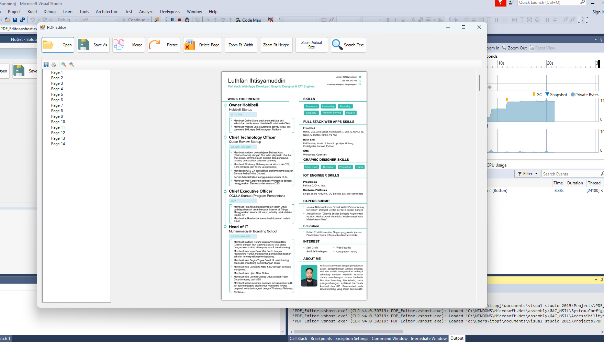
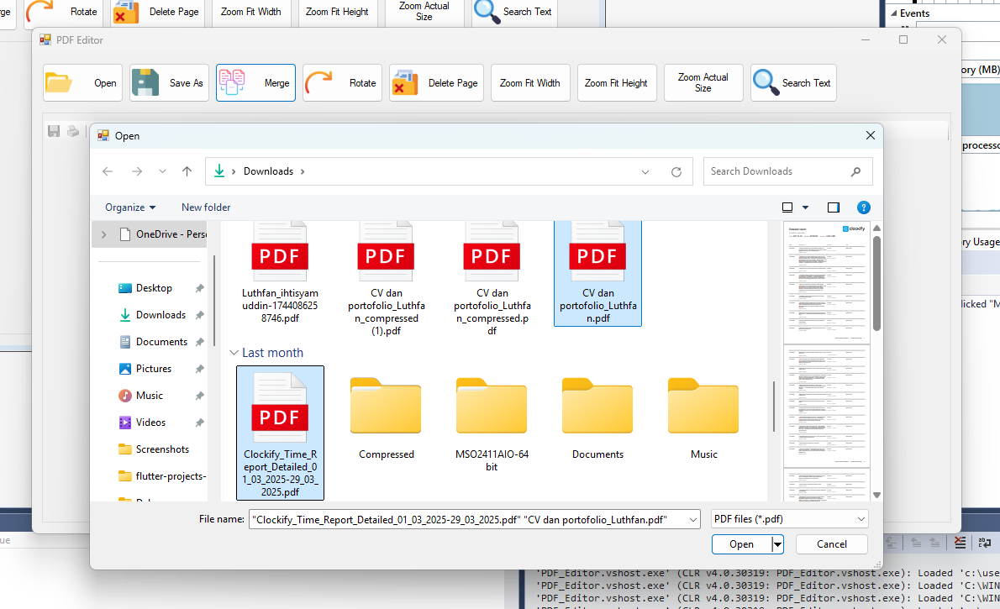

# PDF Editor Desktop Application

## 📄 Project Overview

This project is a **PDF Editing Desktop Application** built with **C#**, **Windows Forms**, and **.NET Framework (Visual Studio 2015)**.  
It utilizes **PdfiumViewer** for PDF rendering and **PdfSharp** for PDF editing functionalities.

👉 Easy to use  
👉 Lightweight and fast  
👉 No complex dependencies

---

## 🚀 Features

- **Open PDF** 📂
- **Save As PDF** 📆
- **Merge Multiple PDFs** ➞️📄
- **Rotate Specific Page** 🔄
- **Delete Specific Page** 🗑️
- **Zoom Modes** 🔍
  - Fit Width
  - Fit Height
  - Fit Best
- **Basic Search Info** 🔎 (notify if unavailable)

---

## 🛠️ Tech Stack

| Technology | Description |
|:---|:---|
| C# | Main programming language |
| Windows Forms | GUI framework |
| PdfiumViewer 2.13.0 | PDF viewing (fast and lightweight) |
| PdfSharp | PDF manipulation (merge, rotate, delete pages) |

---

## 🖥️ Requirements

- **Windows 7 / 8 / 10 / 11**
- **Visual Studio 2015 or later** (target .NET Framework 4.5+)
- **NuGet Packages:**
  - `PdfiumViewer` version `2.13.0`
  - `PdfSharp`
- **External Dependency:**
  - `pdfium.dll` compatible with PdfiumViewer 2.13.0
    - Use pdfium v8 build (Chromium 5282) ➞ [Download pdfium-v8-win-x86.zip](https://github.com/bblanchon/pdfium-binaries/releases/download/chromium%2F5282/pdfium-v8-win-x86.zip)
    - Place `pdfium.dll` inside your `/bin/Debug` and `/bin/Release` folders.

---

## ⚙️ Installation

1. Clone the repository or download the project.
2. Open the solution (`.sln`) in Visual Studio 2015.
3. Install NuGet packages:
   ```bash
   Install-Package PdfiumViewer -Version 2.13.0
   Install-Package PdfSharp
   ```
4. Download `pdfium.dll` (from the link above) and place it into `/bin/Debug/` and `/bin/Release/`.
5. Build and Run the project.

---

## 📸 Screenshots

| Open & View PDF | Merge PDFs |
|:---|:---|:---|
|  |  (screenshots/merge_pdf2.png)|

*(add screenshots if you have, otherwise remove this section)*

---

## 🔥 Special Notes

- **Zoom functionality** uses predefined modes (`FitWidth`, `FitHeight`, `FitBest`) because PdfiumViewer 2.13.0 does not support custom zoom scale.
- **Text Search** functionality is not available in this version because `TextSearchManager` API is only supported in PdfiumViewer >= 4.x for .NET 6+.
- The application is optimized for speed and simplicity.

---

## 💬 Credits

Developed by Luthfan  
Maintained with ❤️ for learning, practice, and freelance showcase.

---

## 📥 License

This project is licensed under the MIT License - feel free to use, modify, and distribute.

